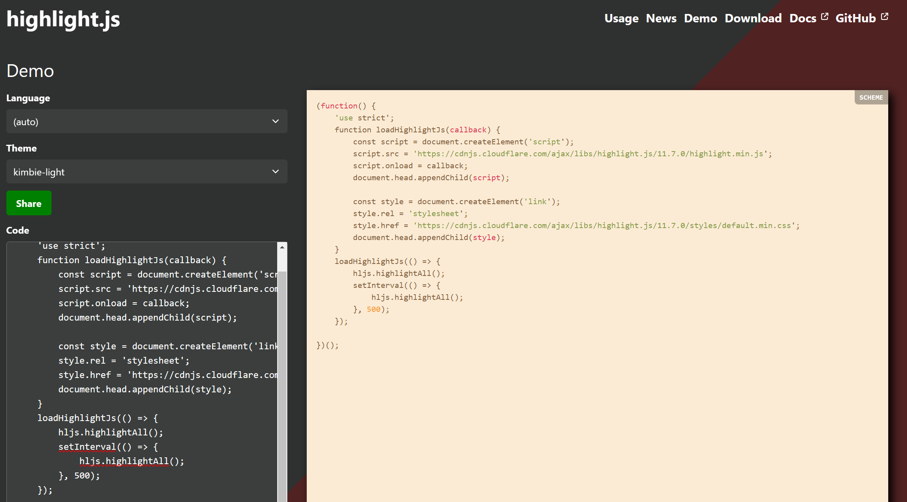
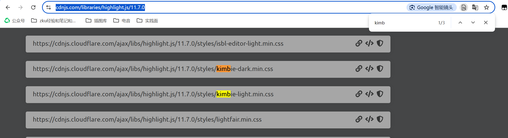

设计思路：代码高亮→找一个已经实现高亮的地方找一些思路→打开VSCode的Markdown插件仓库，发现了`Highlight.js`→决定调用他的`.js`和`.css`样式文件。
## Step1: 调`.js`和`.css`文件：
```javascript
function loadHighlightJs(callback) {
    const script = document.createElement('script');
    script.src = 'https://cdnjs.cloudflare.com/ajax/libs/highlight.js/11.7.0/highlight.min.js';
    
    document.head.appendChild(script);
    script.onload = callback;
    const style = document.createElement('link');
    style.rel = 'stylesheet';
    style.href = 'https://cdnjs.cloudflare.com/ajax/libs/highlight.js/11.7.0/styles/default.min.css';
    document.head.appendChild(style);
}
```

- `html`一般是在`<head>`内引用这些样式文件的，譬如前几天在`catbook-react`里写过的：  
```html
<head>
    <title>Catbook</title>
    <link rel="stylesheet" href="styles.css" />
  </head>
```
- 所以我们想要引入外部的`.js`和`.css`文件，我们使用`const script`/`const style`来声明变量，然后用`document.head.appendChild(script)`来引入到头文件中。
- `style`文件和我们平时在`html`中写的逻辑其实是一样的
- 对于`script`：
  - `script.src = 'https://cdnjs.cloudflare.com/ajax/libs/highlight.js/11.7.0/highlight.min.js';` 脚本地址
  - `script.onload`:`onload` 是 HTML 元素的一个事件处理程序，表示当资源（如图片、脚本等）成功加载后触发的事件。在 `<script>` 元素中，`onload` 事件会在该脚本文件完全下载并执行后被触发。`callback` 是一个函数，当资源加载完毕后，`onload` 事件触发时会调用这个函数。也就是说，`script.onload = callback;` 意味着，当 `script` 元素所引用的 `JavaScript` 文件加载并执行后，执行 `callback` 函数。

ps：第一次去调外面的文件，so是GPT写的，现在才搞懂orz

### 关于选择你喜欢的`css`样式
`highlight.js`给的官方的`demo`在: https://highlightjs.org/demo 在这里可以选择你想要的样式并且预览。找到你喜欢的样式，记住名字，然后在 https://cdnjs.com/libraries/highlight.js/11.7.0 内可以找到cdn服务器储存的css文件，这样调用速度比在github上看快很多。
我们以我这里用的`kimbie-light.min.css`为例：
我们先在https://highlightjs.org/demo中预览，效果如下：

之后我们进行搜索：

点击左侧的link图标，复制对应的url: `https://cdnjs.cloudflare.com/ajax/libs/highlight.js/11.7.0/styles/kimbie-light.min.css`，放入对应的引用的位置~

## Step2: 执行代码高亮（调用`hljs`）
```javascript
    loadHighlightJs(() => {

        hljs.highlightAll();

        setInterval(() => {
            hljs.highlightAll();
        }, 500);
    });
```

参考：`Highlight.js`的官方文档：
> **In the Browser**
The bare minimum for using highlight.js on a web page is linking to the library along with one of the themes and calling highlightAll:
```html
<link rel="stylesheet" href="/path/to/styles/default.min.css">
<script src="/path/to/highlight.min.js"></script>
<script>hljs.highlightAll();</script>
```
>If you need a bit more control over the initialization of Highlight.js, you can use the highlightElement and configure functions. This allows you to better control what to highlight and when.
>For example, here’s the rough equivalent of calling highlightAll but doing the work manually instead:
```javascript
document.addEventListener('DOMContentLoaded', (event) => {
  document.querySelectorAll('pre code').forEach((el) => {
    hljs.highlightElement(el);
  });
});
```
>Please refer to the documentation for configure options.

- `setInterval(() => { highlightCodeBlocks(); }, 100)`: 设置一个定时器，每 500 毫秒执行一次 highlightCodeBlocks，以确保后续动态加载的代码块也能被高亮处理。

## Step3: 复制按钮
还是一样的思路来源，找到了一个脚本`clipboard.js`. 引用和前面的思路一模一样。
```javascript
    function loadClipboardJs(callback) {
        const script = document.createElement('script');
        script.src = 'https://cdnjs.cloudflare.com/ajax/libs/clipboard.js/2.0.8/clipboard.min.js';
        script.onload = callback;
        document.head.appendChild(script);
    }
```
接着我们需要定义到代码块。我们检查`html`的元素.
，发现一般的小块的代码是`<code></code>`来渲染，但是大块的确实是`<pre><code></code></pre>`的渲染，**所以我们的选择器的设计应该是`pre code`**
```javascript
const codeBlocks = document.querySelectorAll('pre code');
```
下面和我们基本设计的思路差不多开始写这个按钮，相当于用面向对象的方法写css类了orz 改变两处的注释值，可以改变相应的颜色。
```javascript
const copyButton = document.createElement('button');
copyButton.textContent = 'Copy'; //modify the text
copyButton.style.position = 'absolute';
copyButton.style.top = '5px';
copyButton.style.right = '10px';
copyButton.style.zIndex = '9999'; //ensure it's on the top
copyButton.style.backgroundColor = '#E8E8E8';  //modify RGB to change the color of the button
copyButton.style.color = '#616161';  //modify RGB to change the color of the text
copyButton.style.cursor = 'pointer';
copyButton.style.padding = '5px 10px';
copyButton.style.border = 'none';
copyButton.style.borderRadius = '3px';
```
按钮的位置：和代码块一一对应，由于js其实没有那么聪明，我们用`Index`来标记一下
```javascript
// Set code block ID
const codeId = `code-block-${index}`;
codeBlock.id = codeId;
copyButton.setAttribute('data-clipboard-target', `#${codeId}`);
codeBlock.parentNode.style.position = 'relative';
codeBlock.parentNode.appendChild(copyButton);
```
在定位上，用`codeBlock.parentNode.style.position = 'relative';`可以保证按钮在父元素，即codeBlock范围定位，`codeBlock.parentNode.appendChild(copyButton);`这句话即保证父子关系（不是很会，一开始全写错了，GPT教的…
下面也是一个思路，我们利用内置的`ClipboardJS`:
```javascript
// Initialize Clipboard.js
const clipboard = new ClipboardJS(copyButton);

clipboard.on('success', function(e) {
    copyButton.textContent = 'Copied!';
    e.clearSelection();
    setTimeout(() => {
        copyButton.textContent = 'Copy';
    }, 2000);
});

clipboard.on('error', function(e) {
    copyButton.textContent = 'Failed';
    setTimeout(() => {
        copyButton.textContent = 'Copy';
    }, 2000);
});
```
在延时2s后改变成原来的文字。
最后利用`loadClipboardJs(AddCopyButtons);`进行调用
## Step4：遇到的问题
代码中的一堆延时和我看不懂的`DOM`基本都在处理两个脚本加载的问题x
### 4.1 MutationObserver
```javascript
// MutationObserver to track dynamic content
function observeDomChanges() {
    const observer = new MutationObserver((mutations) => {
        mutations.forEach(() => {
            AddCopyButtons();  // Add buttons on DOM changes
        });
    });
    observer.observe(document.body, { childList: true, subtree: true });
}
```
>MutationObserver 是一个 JavaScript API，用来监听 DOM 的变动，比如元素的添加、删除，或属性的更改。在动态加载内容的网页上，比如通过 AJAX 加载或用户操作后新增内容的页面，它能够自动检测变化并响应这些变化。 ——GPT

- `observer.observe(document.body, { childList: true, subtree: true });`： 这句代码告诉 MutationObserver 开始监听整个 document.body 的 DOM 变化。具体来说：
- `childList: true`：表示观察直接子节点的添加或删除。
- `subtree: true`：表示观察整个 DOM 树，而不仅仅是直接子节点。如果有任何子元素发生变化，也会被捕获。
- `mutations.forEach(() => { AddCopyButtons(); });`： 每当捕获到 DOM 变动时，回调函数会执行。每个变动会触发一次循环（`mutations.forEach`），并在每次变动时调用 `AddCopyButtons()` 函数，这个函数的作用是**为新添加的代码块添加复制按钮**。

>为什么在另一个Highlight函数上不用呢……实际测试中发现highlight不知道为什么总是会卡顿，所以还是用延时了，毕竟加载上也不是很慢orz

### 4.2 按钮唯一性问题
如果这个元素有按钮了，不进行重复叠加：
`if (!codeBlock.nextSibling || !codeBlock.nextSibling.matches('button')) `条件满足，才继续执行。

## 写在后面：一些留档
GPT给出的、避免重复高亮的函数设计
```javascript
function highlightCodeBlocks() {
    document.querySelectorAll('pre code').forEach((block) => {
        if (!block.classList.contains('hljs')) {
            hljs.highlightElement(block);
        }
    });
}
```
这段写的目的主要是不要重复高亮，所以加了一个对`hljs`的判断，事实上也没有那么必要，因为98本身就没啥高亮，所以直接用`hljs.highlightAll()`的效果估计也够了。
