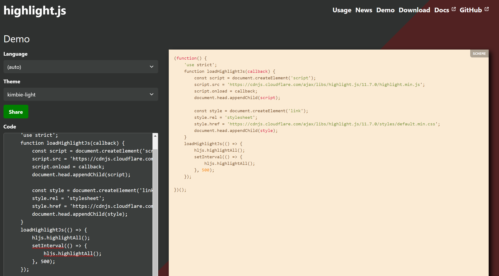
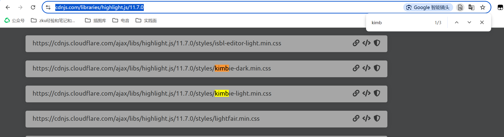

设计思路：代码高亮$\rightarrow$找一个已经实现高亮的地方找一些思路$\rightarrow$打开VSCode的Markdown插件仓库，发现了`Highlight.js`$\rightarrow$决定调用他的`.js`和`.css`样式文件。
## Step1: 调`.js`和`.css`文件：
```javascript
function loadHighlightJs(callback) {
    const script = document.createElement('script');
    script.src = 'https://cdnjs.cloudflare.com/ajax/libs/highlight.js/11.7.0/highlight.min.js';
    
    document.head.appendChild(script);
    script.onload = callback;
    const style = document.createElement('link');
    style.rel = 'stylesheet';
    style.href = 'https://cdnjs.cloudflare.com/ajax/libs/highlight.js/11.7.0/styles/default.min.css';
    document.head.appendChild(style);
}
```

- `html`一般是在`<head>`内引用这些样式文件的，譬如前几天在`catbook-react`里写过的：  
```html
<head>
    <title>Catbook</title>
    <link rel="stylesheet" href="styles.css" />
  </head>
```
- 所以我们想要引入外部的`.js`和`.css`文件，我们使用`const script`/`const style`来声明变量，然后用`document.head.appendChild(script)`来引入到头文件中。
- `style`文件和我们平时在`html`中写的逻辑其实是一样的
- 对于`script`：
  - `script.src = 'https://cdnjs.cloudflare.com/ajax/libs/highlight.js/11.7.0/highlight.min.js';` 脚本地址
  - `script.onload`:`onload` 是 HTML 元素的一个事件处理程序，表示当资源（如图片、脚本等）成功加载后触发的事件。在 `<script>` 元素中，`onload` 事件会在该脚本文件完全下载并执行后被触发。`callback` 是一个函数，当资源加载完毕后，`onload` 事件触发时会调用这个函数。也就是说，`script.onload = callback;` 意味着，当 `script` 元素所引用的 `JavaScript` 文件加载并执行后，执行 `callback` 函数。

ps：第一次去调外面的文件，so是GPT写的，现在才搞懂orz

### 关于选择你喜欢的`css`样式
`highlight.js`给的官方的`demo`在: https://highlightjs.org/demo 在这里可以选择你想要的样式并且预览。找到你喜欢的样式，记住名字，然后在 https://cdnjs.com/libraries/highlight.js/11.7.0 内可以找到cdn服务器储存的css文件，这样调用速度比在github上看快很多。
我们以我这里用的`kimbie-light.min.css`为例：
我们先在https://highlightjs.org/demo中预览，效果如下：

之后我们进行搜索：

点击左侧的link图标，复制对应的url: `https://cdnjs.cloudflare.com/ajax/libs/highlight.js/11.7.0/styles/kimbie-light.min.css`，放入对应的引用的位置~

## Step2: 执行代码高亮（调用`hljs`）
```javascript
    loadHighlightJs(() => {

        hljs.highlightAll();

        setInterval(() => {
            hljs.highlightAll();
        }, 500);
    });
```

参考：`Highlight.js`的官方文档：
> **In the Browser**
The bare minimum for using highlight.js on a web page is linking to the library along with one of the themes and calling highlightAll:
```html
<link rel="stylesheet" href="/path/to/styles/default.min.css">
<script src="/path/to/highlight.min.js"></script>
<script>hljs.highlightAll();</script>
```
>If you need a bit more control over the initialization of Highlight.js, you can use the highlightElement and configure functions. This allows you to better control what to highlight and when.
>For example, here’s the rough equivalent of calling highlightAll but doing the work manually instead:
```javascript
document.addEventListener('DOMContentLoaded', (event) => {
  document.querySelectorAll('pre code').forEach((el) => {
    hljs.highlightElement(el);
  });
});
```
>Please refer to the documentation for configure options.

- `setInterval(() => { highlightCodeBlocks(); }, 100)`: 设置一个定时器，每 500 毫秒执行一次 highlightCodeBlocks，以确保后续动态加载的代码块也能被高亮处理。


## 写在后面：一些留档
GPT给出的、避免重复高亮的函数设计
```javascript
function highlightCodeBlocks() {
    document.querySelectorAll('pre code').forEach((block) => {
        if (!block.classList.contains('hljs')) {
            hljs.highlightElement(block);
        }
    });
}
```
这段写的目的主要是不要重复高亮，所以加了一个对`hljs`的判断，事实上也没有那么必要，因为98本身就没啥高亮，所以直接用`hljs.highlightAll()`的效果估计也够了。
